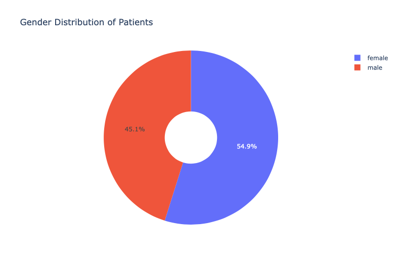

# COVID-19 South Korea Demographical Visualization 

## Motivation 
Covid-19 influence various aspects of the world. In previous visualizatio project, we have took a look at the overall condition of COVID-19, in this project, the main task is to explore the degraphic side of COVID-19 impact. 

## Dataset Overview 
The data used in this project could be found in [kaggle](https://www.kaggle.com/kimjihoo/coronavirusdataset). There are `Case.csv` that describe the overall case information of COVID-19. `PatientInfo.csv`, illustrate COVID-19 patient information. `Region.csv` describes conditions of regions during COVID-19 period. `TimeAge.csv` and `TimeGender.csv` described the age and gender information as time goes on. `Weather.csv` introduce information about weather during observational period. 

With more data on patient, regions and environment condition. The project could explore COVID-19 from the human and regions perspective. 

## Data Preprocessing 
### Load dataset 
```python
    # loading dataset 
    case_data = pd.read_csv('./data_source/covid_lab_data/Case.csv')
    patientInfo_data = pd.read_csv('./data_source/covid_lab_data/PatientInfo.csv')
    region_data = pd.read_csv('./data_source/covid_lab_data/Region.csv')
    timeAge_data = pd.read_csv('./data_source/covid_lab_data/TimeAge.csv')
    timeGender_data = pd.read_csv('./data_source/covid_lab_data/TimeGender.csv')
    weather_data = pd.read_csv('./data_source/covid_lab_data/Weather.csv')
```

### Dataset Overview 

```python 
case_data.info()
```

```text
<class 'pandas.core.frame.DataFrame'>
RangeIndex: 174 entries, 0 to 173
Data columns (total 8 columns):
 case_id          174 non-null int64
province          174 non-null object
city              174 non-null object
group             174 non-null bool
infection_case    174 non-null object
confirmed         174 non-null int64
latitude          174 non-null object
longitude         174 non-null object
dtypes: bool(1), int64(2), object(5)
memory usage: 9.8+ KB
```

```python3
patientInfo_data.info()
```

```text 
<class 'pandas.core.frame.DataFrame'>
RangeIndex: 5165 entries, 0 to 5164
Data columns (total 14 columns):
patient_id            5165 non-null int64
sex                   4043 non-null object
age                   3785 non-null object
country               5165 non-null object
province              5165 non-null object
city                  5071 non-null object
infection_case        4246 non-null object
infected_by           1346 non-null object
contact_number        791 non-null object
symptom_onset_date    690 non-null object
confirmed_date        5162 non-null object
released_date         1587 non-null object
deceased_date         66 non-null object
state                 5165 non-null object
dtypes: int64(1), object(13)
memory usage: 565.0+ KB
```

```python3
region_data.info()
```

```text
<class 'pandas.core.frame.DataFrame'>
RangeIndex: 244 entries, 0 to 243
Data columns (total 12 columns):
code                        244 non-null int64
province                    244 non-null object
city                        244 non-null object
latitude                    244 non-null float64
longitude                   244 non-null float64
elementary_school_count     244 non-null int64
kindergarten_count          244 non-null int64
university_count            244 non-null int64
academy_ratio               244 non-null float64
elderly_population_ratio    244 non-null float64
elderly_alone_ratio         244 non-null float64
nursing_home_count          244 non-null int64
dtypes: float64(5), int64(5), object(2)
memory usage: 23.0+ KB
```
```python
timeAge_data.info()
```
```text
<class 'pandas.core.frame.DataFrame'>
RangeIndex: 1089 entries, 0 to 1088
Data columns (total 5 columns):
date         1089 non-null object
time         1089 non-null int64
age          1089 non-null object
confirmed    1089 non-null int64
deceased     1089 non-null int64
dtypes: int64(3), object(2)
memory usage: 42.6+ KB
```

```python
timeGender_data.info()
```
```text
<class 'pandas.core.frame.DataFrame'>
RangeIndex: 242 entries, 0 to 241
Data columns (total 5 columns):
date         242 non-null object
time         242 non-null int64
sex          242 non-null object
confirmed    242 non-null int64
deceased     242 non-null int64
dtypes: int64(3), object(2)
memory usage: 9.5+ KB
```

```python
weather_data.info()
```

```text
<class 'pandas.core.frame.DataFrame'>
RangeIndex: 26271 entries, 0 to 26270
Data columns (total 10 columns):
code                     26271 non-null int64
province                 26271 non-null object
date                     26271 non-null object
avg_temp                 26256 non-null float64
min_temp                 26266 non-null float64
max_temp                 26268 non-null float64
precipitation            26271 non-null float64
max_wind_speed           26262 non-null float64
most_wind_direction      26242 non-null float64
avg_relative_humidity    26251 non-null float64
dtypes: float64(7), int64(1), object(2)
memory usage: 2.0+ MB
```

Looking at the datasets, there was no opportunities for joining multiple datasets. So the analysis or visualization will be performed on each dataset. 


## Case Dataset 
Case dataset contains general data information in this dataset. The location of the records are in Korean. 

First, I will visualize the confirmed case on map to give an overview of the confirmed case distribution across the country. 

```python 
    '''
Explore the case_data

'''
def create_lat_lon_confirmed_dataset(origin_data):
    # create a new dataframe with province, city, confirmed, latitude and longitude. 
    lat_lon_confirmed_dataset = case_data[['province', 'city', 'confirmed', 'latitude', 'longitude']]
    lat_lon_confirmed_dataset['text'] = lat_lon_confirmed_dataset['province'] + ' ' + lat_lon_confirmed_dataset['city'] + ' Confirmed Case:' + lat_lon_confirmed_dataset['confirmed'].astype(str)
    return lat_lon_confirmed_dataset

def get_map_fig(dataset):
    # create a new figure to visualize case distribution across nation 
    lat_lon_confirmed_dataset = dataset
    fig = go.Figure(
        data=go.Scattergeo(
            lon=lat_lon_confirmed_dataset['longitude'],
            lat=lat_lon_confirmed_dataset['latitude'], 
            text = lat_lon_confirmed_dataset['text'],
            mode = 'markers',
            marker = dict(
                size = 8,
                opacity = 0.8,
                reversescale = True,
                autocolorscale = False,
                symbol = 'square',
                line = dict(
                    width=1,
                    color='rgba(102, 102, 102)'
                ),
                colorscale = 'Blues',
                cmin = 0,
                colorbar_title="Confirmed cases in deffierent regions"
            )
        )
    )
    # update the figure layout 
    fig.update_layout(
        title = 'Confirmed COVID-19 cases across various provinces',
        geo = dict(
            showland=True,
            scope="asia",
            landcolor = "rgb(250, 250, 250)",
            subunitcolor = "rgb(217, 217, 217)",
            countrycolor = "rgb(217, 217, 217)",
            countrywidth = 2,
            subunitwidth = 2
        )
    )
    return fig 

new_dataset = create_lat_lon_confirmed_dataset(case_data)
fig = get_map_fig(new_dataset)
fig.show()
```


Observed from the map, it appears that, there are mainly two center for confirmed case. The one on the upper left of the land is around Seoul and the one on the lower right bottom side is around Daegu and Busan. This makes sense that Seuol is the capital of South Korea, Daegu and Bushan are of top major metropolitan in South Korea with dense populations. 

### Confirmed case grouped by `infection_case` and `group` 

The features of `infection_case` and `group` cast some truth on the source of the affection in the dataset. I would like to visualize the confirmed case grouped by both of them. 

There are mainly two value for `group` value, that explained the approaches that COVID-19 is spread out. After some exploration, most of the cases are spread as group, except for few cases in non-group approach. I would like to examine those two categories separately. 

```python

    def get_grouped_data(origin_dataset):
        # get the grouped and ungrouped dataset for confirmed number and infection_case 
        confirmed_grouped = origin_dataset[['group', 'infection_case', 'confirmed']]
        true_group_confirmed = confirmed_grouped.loc[confirmed_grouped['group'] == True]
        false_group_confirmed = confirmed_grouped.loc[confirmed_grouped['group'] == False]
        return {
            'Grouped': true_group_confirmed,
            'UnGrouped': false_group_confirmed
        } 
    # sort and preprocess the dataset 
    groupby_data = get_grouped_data(case_data)
    grouped_confirm = groupby_data['Grouped']
    no_grouped_confirm = groupby_data['UnGrouped']
    top20_confirmed_grouped = grouped_confirm.groupby(by=["infection_case"], as_index=False).sum().sort_values(by="confirmed", ascending=False).head(20)
    top20_confirmed_no_grouped = no_grouped_confirm.groupby(by=["infection_case"], as_index=False).sum().sort_values(by="confirmed", ascending=False).head(20)

    def get_bar_fig(grouped_data, group_type):
        # get the bar chart and display the chart 
        fig = px.bar(grouped_data, y='confirmed', x='infection_case', text='confirmed')
        fig.update_traces(texttemplate='%{text:.2s}', textposition='outside')
        fig.update_layout(
            uniformtext_minsize=8, 
            uniformtext_mode='hide',
            title_text='Top 20 Confirmed ' + group_type + ' Infection Cases '
        )
        fig.show()
    # plot bar chart for each group 
    get_bar_fig(top20_confirmed_grouped, 'Grouped')
    get_bar_fig(top20_confirmed_no_grouped, 'Non-grouped')
    
```


Observing from the bar chart, in grouped confriming cases, `Sincheonji Church` is the main source for grouped confirmed cases, with 5.2k. Other groups number are far more less than the church. In non-grouped bar chart, the main source of confirmed cases is `contact with patient`, followed by other sources and overseas sources. And the comparison between two charts show that the mainly source of confirmed cases introduced from group gethering and direct contact with patient, which well explained the later policy to keep social distance and reduce group gethering. 

## Patient Info 

`patientInfo` table include patient information. I will take a look at the gender distribution of patients first. 

```python
    def get_gender_data(dataset):
        gender_data = dataset['sex']
        gender_df = pad.value_counts(gender_data).to_frame().reset_index()
        return gender_df

    def generate_fig(gender_data):
        gender = ['male', 'female']
        values = [1825, 2218]
        fig = go.Figure(data=[go.Pie(labels=gender, values=values, hole=.3)])
        fig.update_layout(
            title_text='Gender Distribution of Patients'
        )
    
    fig.show()
```


Observe from the pie chart. There is not much gender difference among the patients. Female number is a little larger than male number. 

Then I will explore the age distribution of patient.

```python
    def get_age_dataset(dataset):
        age_dataset = dataset['age']
        age_table = pd.value_counts(age_dataset).to_frame().reset_index()
        return age_table

    def get_ages_distribution_fig(age_table):
        ages = ['0s', '10s', '20s', '30s', '40s', '50s', '60s', '70s', '80s', '90s', '100s']
        values = [66, 178, 899, 523, 518, 667, 482, 232, 170, 49, 1]
        fig = go.Figure(data=[
            go.Pie(
                labels = ages,
                values = values,
                pull = [0, 0, 0.3, 0.1, 0, 0.2, 0, 0, 0, 0, 0]
            )
        ])
        fig.update_layout(
            title_text='Distribution of Ages Among Patients'
        )

fig.show()
```


Observe from the chart, there are prominent large number of patient in 20s, 50s, 30s, 40s and 60s. It seems that 20 to 40 are ages that most likely to be sick with COVID-19. 

There are three dates available in patient information dataset. `Confirmed Date`, `Released Date`, `Symptom Onset Date` and `Deceased Date`. I would like to see the trend of those dates with each patients. 

```python
    def get_datasets(dataset):
        patientInfo_data = dataset
        symptom_onset_date = patientInfo_data['symptom_onset_date']
        confirmed_date = patientInfo_data['confirmed_date']
        release_date = patientInfo_data['released_date']
        deceased_date = patientInfo_data['deceased_date']
        return {
            'symptom': symptom_onset_date, 
            'confirmed': confirmed_date,
            'released': release_date,
            'deceased': deceased_date
        }

    fig = go.Figure()
    fig.add_trace(go.Scatter(x=patient_id, y=symptom_onset_date, mode='lines', name='symptom onset date'))
    fig.add_trace(go.Scatter(x=patient_id, y=confirmed_date, mode='lines', name='confirm date'))
    fig.add_trace(go.Scatter(x=patient_id, y=release_date, mode='lines', name='release date'))
    fig.add_trace(go.Scatter(x=patient_id, y=deceased_date, mode='lines', name='deceased date'))

    fig.update_layout(
        title_text = 'Time Series Visualization for patients',
        width = 1000
    )
    fig.show()
    
``` 


The line plot of dates on the graph reveals some facts about the patient with COVID-19. There are cases where released date is very close to confimed cases. Most of the cases are released after confirmed after certain period of treatment. And the time lap between those two dates seems decreases. 


## Region Information 

`Region` contains information regarding region. The location of region, the population distribution around it. Nusing home number around the neighborhood. 

### Visualize elementary school, kindergarten, university and nursing home condition number distribution across Korea

I would like to take a look at the distribution of elementary school, kindergarten, university and nursing home number distributed across various provinces 

```python 
    # group the counts by province 
    # elementary_school_count 
        # kindergardeb_school_count 
    def get_grouped_data(origin_dataset, sum_feature):
        confirmed_grouped = origin_dataset[['province', sum_feature]]
        confirmed_groupby_privince = confirmed_grouped.groupby(['province'], as_index=False).sum()

        return confirmed_groupby_privince

    grouped_elementary_ordered = get_grouped_data(region_data, 'elementary_school_count').sort_values(by="elementary_school_count", ascending=False).head(20)
    
    grouped_kindergarten_ordered = get_grouped_data(region_data, 'kindergarten_count').sort_values(by="kindergarten_count", ascending=False).head(20)
    
    grouped_university_ordered = get_grouped_data(region_data, 'university_count').sort_values(by="university_count", ascending=False).head(20)
    
    grouped_nursing_home_ordered = get_grouped_data(region_data, 'nursing_home_count').sort_values(by="nursing_home_count", ascending=False).head(20)

```

Plot elementary school number grouped by province. 

```python

    fig_elementary_order = go.Figure(go.Bar(
        x=grouped_elementary_ordered['elementary_school_count'],
        y=grouped_elementary_ordered['province'],
        orientation='h'
    ))

    fig_elementary_order.update_layout(
        title_text = 'Bar Chart for Province Ordered By Elementary School Count ',
        width = 1000
    )

    fig_elementary_order.show()
```


Same for kindergarten count. 

```python
    fig_kindergarten_order = go.Figure(go.Bar(
        x=grouped_kindergarten_ordered['kindergarten_count'],
        y=grouped_kindergarten_ordered['province'],
        orientation='h'
    ))
    fig_kindergarten_order.update_layout(
        title_text = 'Bar Chart for Province Ordered By Kindergarten Count ',
        width = 1000
    )

    fig_kindergarten_order.show()
```


Same for university count number grouped by province 

```python
    fig_university_order = go.Figure(go.Bar(
        x=grouped_university_ordered['university_count'],
        y=grouped_university_ordered['province'],
        orientation='h'
    ))
    fig_university_order.update_layout(
        title_text = 'Bar Chart for Province Ordered By University Count ',
        width = 1000
    )

    fig_university_order.show()
```


Same for nursing home counts. 

```python
    fig_nursing_home_order = go.Figure(go.Bar(
        x=grouped_nursing_home_ordered['nursing_home_count'],
        y=grouped_nursing_home_ordered['province'],
        orientation='h'
    ))
    fig_nursing_home_order.update_layout(
        title_text = 'Bar Chart for Province Ordered By Nursing Home Count',
        width = 1000
    )

    fig_nursing_home_order.show()
```


Observe from the bar chart, Top 5 province with highest elementary school counts are: `Gyeonggi-do`, `Seoul`, `Gyeongsangnam-do`, `Gyeongsangbuk-do`, `Jeollanam-do`. 

Top 5 province with highest kindergarten counts: `Gyeonggi-do`, `Seoul`, `Gyeongsangbuk-do`, `Gyeongsangnam-do` and `Jeollanam-do`. 

Top 5 province with highest university counts: 
`Gyeonggi-do`, `Seoul`, `Gyeongsangbuk-do`, `Busan` and `Gyeongsangnam-do`. 

There are `Gyeonggi-do`, `Seoul`, `Gyeongsangnam-do`, `Gyeongsangbuk-do`, `Busan` and `Jeollanam-do` that are among the top of those counts. This result is the same as the map shown above. 

Same visualization for elderly population ratio and elderly alone ratio. 

```python

    fig_elderly_population = go.Figure(go.Bar(
        x=elderly_population_ordered['elderly_population_ratio'],
        y=elderly_population_ordered['province'],
        orientation='h'
    ))
    fig_elderly_population.update_layout(
        title_text = 'Bar Chart for Province Ordered By Average Elderly Population Ratio',
        width = 1000
    )

    fig_elderly_population.show()
```


```python
   fig_elderly_alone = go.Figure(go.Bar(
        x=elderly_alone_ordered['elderly_alone_ratio'],
        y=elderly_alone_ordered['province'],
        orientation='h'
    ))
    fig_elderly_alone.update_layout(
        title_text = 'Bar Chart for Province Ordered By Average Elderly Alone Ratio',
        width = 1000
    )

    fig_elderly_alone.show() 
```


For elderly population ratio the Top five provinces are `Jeollanam`, `Gyeongsangbuk-do`, `Jeollabuk-do`, `Gyeongsangnam-do` and `Chungcheongnam`. For the elderly alone ratio, the top five provinces are `Jeollanam-do`, `Jeollabuk-do`, `Gyeongsangbuk-do`, `Gyeongsangnam-do` and `Chungcheongbuk-do`. There are some overlaps among those top provinces. 


## Time Age Visualization 

For timeAge dataset, there are `date`, `time`, `age`, `confirmed` and `deceased` features. 

### Confirmed and Deceased cases for different ages 
I will take a look at confirmed and deceased cases number in different ages. 

```python
    fig = go.Figure()
    fig.add_trace(go.Bar(
        y = ['0', '10s', '20s', '30s', '40s', '50s', '60s', '70s', '80s'],
        x = [16107, 68752, 345827, 137539, 168250, 230030, 158505, 82107, 54086],
        name='Confirmed Number',
        orientation='h',
        marker=dict(
            color='rgba(246, 78, 139, 1.0)',
            line=dict(color='rgba(246, 78, 139, 1.0)')
        )
    ))

    fig.add_trace(go.Bar(
        y = ['0', '10s', '20s', '30s', '40s', '50s', '60s', '70s', '80s'],
        x = [0, 0, 0, 194, 295, 1537, 3743, 7599, 12136],
        name = 'Deceased Number',
        orientation = 'h',
        marker=dict(
            color='rgba(58, 71, 80, 0.6)',
            line=dict(color='rgba(58, 71, 80, 1.0)', width=3)
        )
    ))

    fig.update_layout(
        title_text='Confirmed and Deceased Cases for different Ages'
    )
```


As seen from the barchart, there are two peaks of the confirmed cases `50s` and `20s`. However, the deceased number are larger in `80s`, `70s` and `60s`. This point out the fact that covid-19 is dangerous to older people and less harmful to younger generations. 

### Time Series Visualization for Confirmed and Released Number 

```python
    confirmed_date = timeAge_data['date']
    confirmed_number = timeAge_data['confirmed']
    deceased_number = timeAge_data['deceased']
    patient_id = np.linspace(0, 5165, 5165)

    fig = go.Figure()
    fig.add_trace(go.Scatter(x=confirmed_date, y=confirmed_number, mode='lines', name='confirmed number'))
    fig.add_trace(go.Scatter(x=confirmed_date, y=deceased_number, mode='lines', name='deceased number'))

    fig.update_layout(
        title_text = 'Time Series Visualization for Confirmed and Released Number',
        width = 1000
    )
    fig.show()
```


The time series visualization for confirmed and deceased number show that confirmed cases increases as time goes on. The deceased cases while grows larger, the increases are not as prominent as confirmed cases.


## Time Gender Visualization 

There are `date`, `time`, `sex`, `confirmed` and `deceased`. I would like to take a look at confirmed and deceased number for different genders. 

```python
    sex_confirmed_deceased = timeGender_data[['sex', 'confirmed', 'deceased']]
    data_groupby_sex = sex_confirmed_deceased.groupby(['sex'], as_index=False).sum()

    data_groupby_sex.head(20)

    fig = go.Figure()
    fig.add_trace(go.Bar(
        y = ['female', 'male'],
        x = [747467, 513727],
        name='Confirmed Number',
        orientation='h',
        marker=dict(
            color='rgba(246, 78, 139, 1.0)',
            line=dict(color='rgba(246, 78, 139, 1.0)')
        )
    ))

    fig.add_trace(go.Bar(
        y = ['female', 'male'],
        x = [12019, 13484],
        name = 'Deceased Number',
        orientation = 'h',
        marker=dict(
            color='rgba(58, 71, 80, 0.6)',
            line=dict(color='rgba(58, 71, 80, 1.0)', width=3)
        )
    ))

    fig.update_layout(
        title_text='Confirmed and Deceased Cases for different Genders',
        barmode='stack'
    )
```


There are confirmed and deceased number for female and male. From the bar chart, we could observed that female confirmed cases are much larger than male cases. In contrast, the deceased number for male is larger than female. 


