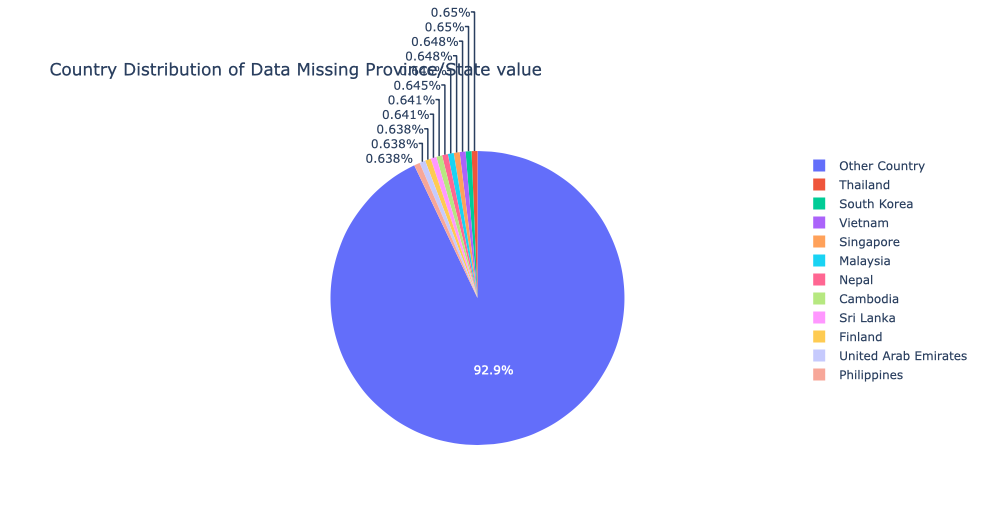
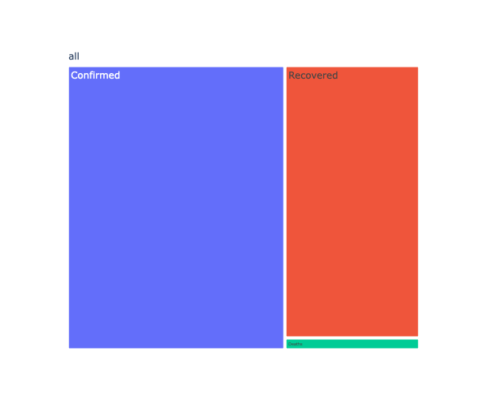
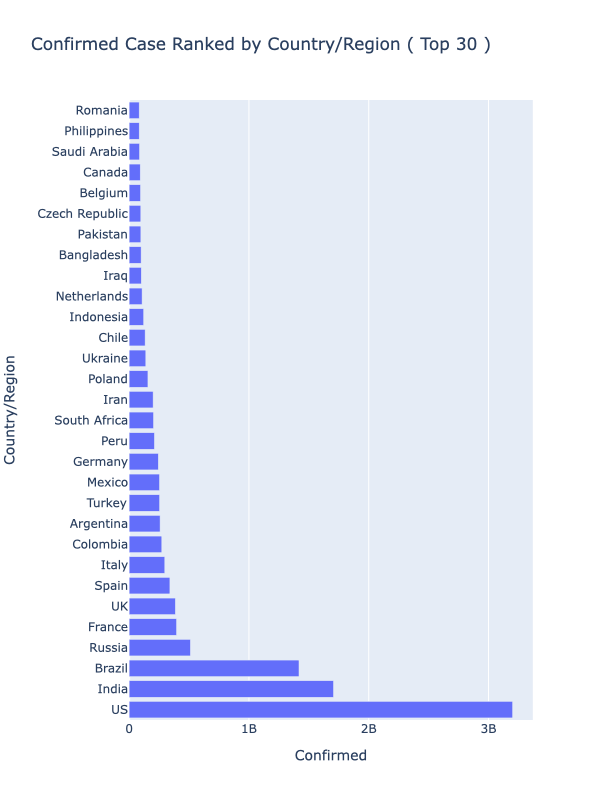
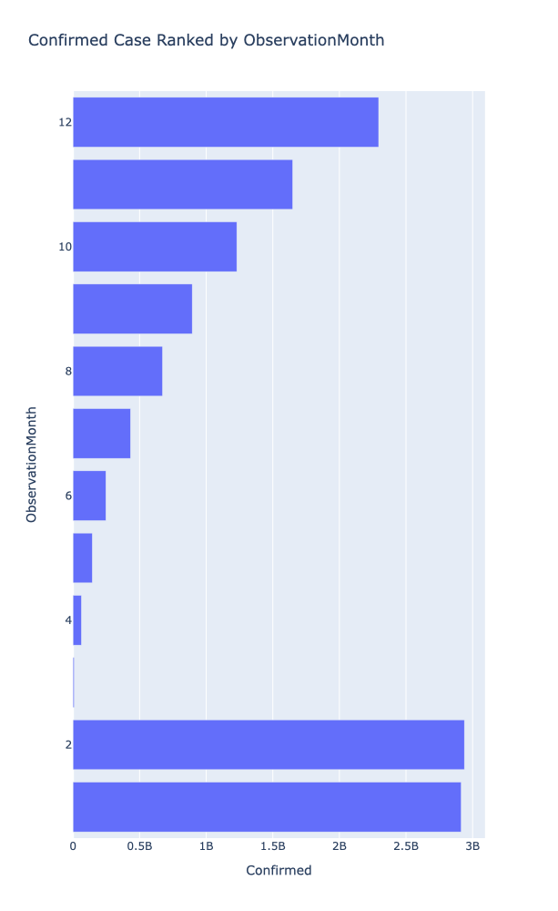
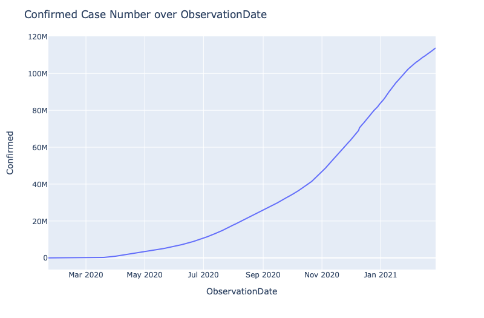
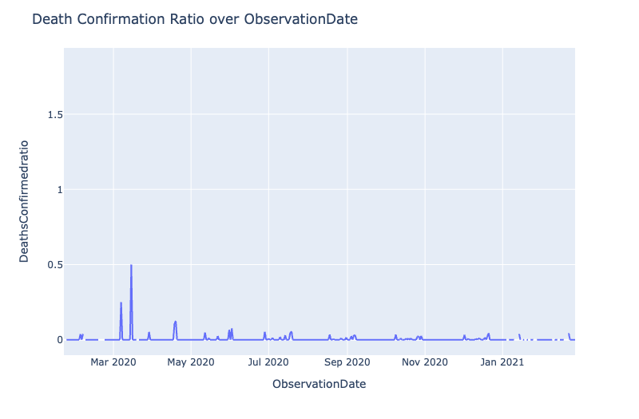
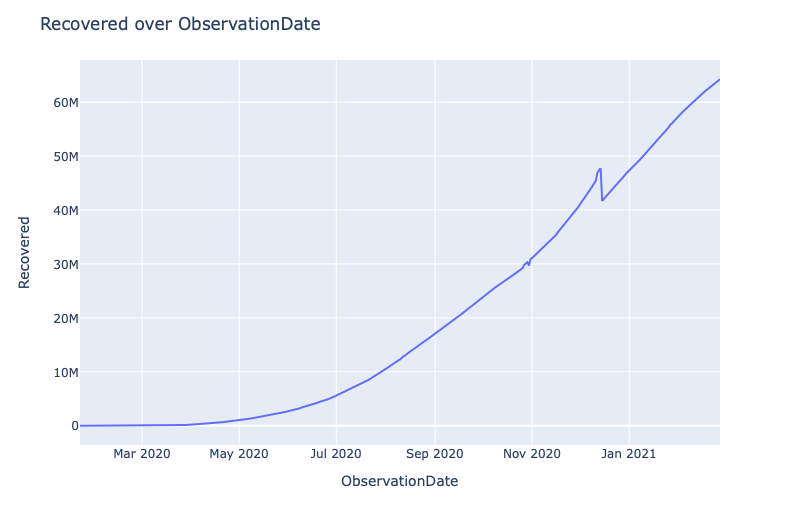
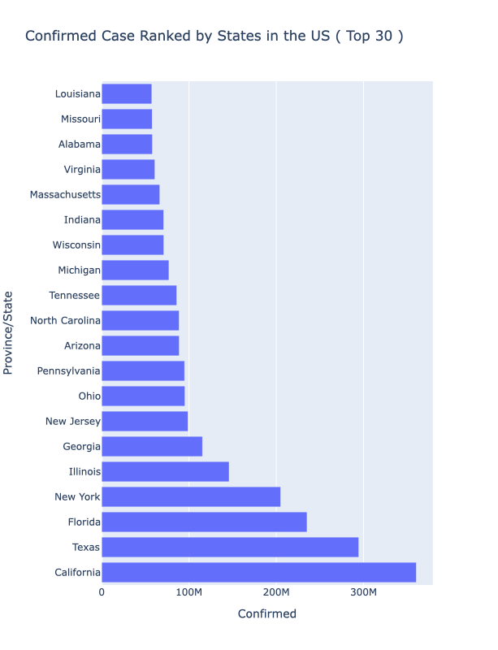

# Visualization during COVID-19 in the year of 2019

## Motivation 
COVID-19 has been largly affect the world. It begin to spread out since 2019. The purpose of this project is to give an overall of the condition of COVID-19 of 2019 to present mainly. And there will be emphasis on visualization of the pedamic. The project is written in python and visualization part handled by [plotly](https://plotly.com/). 

## Data Prepressing  
The dataset in this project could be found at [kaggle](https://www.kaggle.com/sudalairajkumar/novel-corona-virus-2019-dataset). Load the dataset first. 

``` python
# Loading Data 
covid_2019 = pd.read_csv('./data_source/covid_19_data.csv')
covid_2019.info()
```

The dataset information is listed as follows: 

```text
<class 'pandas.core.frame.DataFrame'>
RangeIndex: 236017 entries, 0 to 236016
Data columns (total 8 columns):
SNo                236017 non-null int64
ObservationDate    236017 non-null object
Province/State     173972 non-null object
Country/Region     236017 non-null object
Last Update        236017 non-null object
Confirmed          236017 non-null float64
Deaths             236017 non-null float64
Recovered          236017 non-null float64
dtypes: float64(3), int64(1), object(4)
memory usage: 14.4+ MB
```

There are eight features in the dataset, `observationDate` is the date for dataset record, `Province/State` is the observational position, more detailed location information is in `Country/Region`. `Last Update` date specifies the date when the dataset is updated. `Confirmed`, `Deaths` and `Recovered` are variables that describe the overall COVID-19 case condition. 

There are two columns that will not be used in the project, `SNo` and `Last Update`. 

```Python
# Remove unnecessary columns 
del covid_2019['SNo']
del covid_2019['Last Update']
```

## Handling Missing Values 

This section handles checking the missing values of different features. 

```python
# Handling missing value 
# check the missing value in each colmn 
observation_date = covid_2019[['ObservationDate']]
covid_2019.isna().sum()
```

```text
ObservationDate        0
Province/State     62045
Country/Region         0
Confirmed              0
Deaths                 0
Recovered              0
dtype: int64
```

There are missing values in `Province/State` variable. Let's take a look at it.

There are province values that are missing from the dataset. I created a dataframe with rows contain missing values in Province and State. The distribution of the country of those rows would tell us some hint about the reason why those values are missing. 

```python
'''
    create a new dataframe based on the rows that has missing value for Province 
    plot pie chart of distribution of the countries 
    
'''

def get_missing_province(self, covid_2019):
    COUNTS_CUT = 390
    # table with only missing values 
    df_missing_province = covid_2019[(covid_2019['Province/State'].isna())]
    # create frequency table of countries and transform to dataframe 
    df_missing_country = df_missing_province['Country/Region'].value_counts().rename_axis('Country/Region').reset_index(name='Counts')
    df_missing_country = pd.DataFrame(df_missing_country)
    # showing only some larger counts countries 
    df_missing_country.loc[df_missing_country['Counts'] < COUNTS_CUT, 'Country/Region'] = 'Other Country'
    return df_missing_country

'''
    Get minimum and maximum counts for the countries 
    
'''
def get_min_max_of_missing_country(self, df_missing_country): 
    return (df_missing_country['Counts'].min(), df_missing_country['Counts'].max())

'''
    Plot pie chart based on country and counts 
    
'''
def plot_pie_chart(self, df_missing_country):
    fig = px.pie(df_missing_country, values='Counts', names='Country/Region', title='Country Distribution of Data Missing Province/State value')
    fig.show()         
```



At this point, I am not sure if we need to remove the `Province/State` column or not. Geographical information could be supplied by `Country/Region`. 

## Compute Month and Weekday Value based on `ObservationDate` 

I will use the weekday and month values for analysis purpose. So I need to extract `weekday` and `month` information from original dataset to create new columns of `ObservationWeekday` and `ObservationMonth`. 

``` python 

    '''
        Add weekday and month columns to the old dataset 
    '''

    def add_weekday_month_columns(dataset):
        datetime_df = pd.to_datetime(covid_2019['ObservationDate'])
        covid_2019['ObservationWeekday'] = pd.to_datetime(covid_2019['ObservationDate']).dt.dayofweek
        covid_2019['ObservationMonth'] = pd.to_datetime(covid_2019['ObservationDate']).dt.month
```


## Compute Ratio of `death/confirm` and `recovered/confirmed`

I will use the ratio of Death/Confirm and Recovered/Confirmed lator on, so compute them and create new feature for those ratio. 

```python 

    def compute_ratio(numerator_feature: str, denominator_feature: str, dataset):
        dataset[numerator_feature + denominator_feature + 'ratio'] = dataset[numerator_feature]/dataset[denominator_feature]

    ompute_ratio('Deaths', 'Confirmed', covid_2019)
    compute_ratio('Recovered', 'Confirmed', covid_2019)

```

After the new columns created the dataframe becomes: 

```text
<class 'pandas.core.frame.DataFrame'>
RangeIndex: 236017 entries, 0 to 236016
Data columns (total 10 columns):
ObservationDate            236017 non-null object
Province/State             173972 non-null object
Country/Region             236017 non-null object
Confirmed                  236017 non-null float64
Deaths                     236017 non-null float64
Recovered                  236017 non-null float64
ObservationWeekday         236017 non-null int64
ObservationMonth           236017 non-null int64
DeathsConfirmedratio       233240 non-null float64
RecoveredConfirmedratio    233709 non-null float64
dtypes: float64(5), int64(2), object(3)
memory usage: 18.0+ MB
```

## Visualization 

### Confirmed, Death and Recovered visulization 

I would like to see the distribution of Confirmed, Death and Recover as a treemap. 

```python

    def build_treemap_dataset(dataset): 
        case_df = dataset[['Confirmed', 'Deaths', 'Recovered']].sum()
        treemap_data = {
            'all': ['all', 'all', 'all'],
            'Categories': ['Confirmed', 'Deaths', 'Recovered'],
            'Values': [case_df['Confirmed'], case_df['Deaths'], case_df['Recovered']]
        }
        treemap_df = pd.DataFrame(treemap_data, columns = ['all', 'Categories', 'Values'])
        return treemap_df

    def get_treemap(dataset, path, values)
        fig = px.treemap(treemap_df, path=path, values=values)
        fig.show()

    treemap_df = build_treemap_dataset(covid_2019)
    fig = get_treemap(treemap_df, ['all', 'Categories'], 'Values')
    fig.show()

```


From the Treemap above, Confirmed cases is larger than sum of Recovered cases and deaths cases. Most of the confirmed ones are recovered, deaths number is only a small portion. 

## Confirmed Case Ranked by Country/Region 

I would like to give an overview of how the confirmed case distributed by Country/Region 

```python 
def get_confirmedCase_groupedby_country(dataset):
    # create dataframe of Country/Region and Confirmed 
    # group the df by Country/Region and Compute the group sum 
    # Sort by confirmed case and take the head 30 ones 
    country_confirm = covid_2019[['Country/Region', 'Confirmed']]
    groupby_country = country_confirm.groupby(by="Country/Region", as_index=False).sum()
    groupby_country_sorted = groupby_country.sort_values(by="Confirmed", ascending=False).head(30)
    return groupby_country_sorted 

def get_bar_chart(dataset):
    # create barchart figure and update the layout 
    fig = px.bar(
        groupby_country_sorted, 
        x="Confirmed", 
        y="Country/Region", 
        orientation="h",
        title="Confirmed Case Ranked by Country/Region ( Top 30 )"
    )
    fig.update_layout(height=800)
    return fig 

barchart_df = get_confirmedCase_groupedby_country(covid_2019)
fig = get_bar_chart(barchart_df)
fig.show()
```



As the graph show, the country with highest confirmed cases is US and followed by India. But I don't know about the sampling process of the data, it is possible that there are more data availabel in those countries. So the conclusions could not be made here. 


## Confirmed Case Ranked by Month 

I will group the confirmed case by month, to see if there is difference between different months. Group the data and plot the bar chart. 

```python
    def get_groupby_month_dataset(dataset):
        month_confirm = dataset[['ObservationMonth', 'Confirmed']]
        groupby_month = month_confirm.groupby(by="ObservationMonth" as_index=False).sum()
        groupby_month_sorted = groupby_month.sort_values(by="Confirmed", ascending=False).head(30)
        groupby_month_sorted = groupby_month_sorted[['ObservationMonth', 'Confirmed']]
        fig = px.bar(
            groupby_month_sorted,
            x="Confirmed",
            y="ObservationMonth",
            orientation="h",
            title="Confirmed Case Ranked by ObservationMonth"
        )
        return fig 
    
    fig.update_layout(height=1000)
    fig.show()
```



It looks like that in February the case number is the largest and the number descend in the following month.

From the chart, it seems that the case peaked in winter and decreases as time went on. There is least number of cases in Spring ( March, April, May ). 

## Time series of confirmed case visualization  

Visualize the time series of confirmed case over time. 

```python
    def get_confirmed_date_dataset(dataset):
        confirmed_date = dataset[['ObservationDate', 'Confirmed']]
        confirmed_date_grouped = confirmed_date.groupby('ObservationDate', as_index=False).sum()

        confirmed_date_grouped['ObservationDate'] = pd.to_datetime(confirmed_date_grouped.ObservationDate)
        confirmed_date_sorted = confirmed_date_grouped.sort_values(by="ObservationDate", ascending=True)
        return confirmed_date_sorted

    def get_plot(dataset):
        fig = px.line(
            dataset,
            x='ObservationDate',
            y='Confirmed'
        )
        fig.update_layout(
            width=800,
            title_text='Confirmed Case Number over ObservationDate'
        )

    confirmed_dataset = get_confirmed_date_dataset(covid_2019)
    get_plot(confirmed_dataset)
```



From the graph, the case confirmed number rise from March 2020 to January 2021. And the change rate seems increase during November 2020 to January 2021. 


## Time Series of Death/Confirmed Ratio over Observation Date 




I plot the rate of death/confirmed over observation date. And from the line graph, it seems that the death/confirmed ratio remains low and there is a small peak around April 2020. 

```python
    def get_death_confirmed_ratio(dataset):
        confirmed_date = dataset[['ObservationDate', 'DeathsConfirmedratio']]
        # change the date format to year/month/day 
        confirmed_date['ObservationDate'] = pd.to_datetime(confirmed_date_grouped.ObservationDate)
        confirmed_date_sorted = confirmed_date.sort_values(by="ObservationDate", ascending=True)
        return confirmed_date_sorted

    def get_the_line_plot(dataset):
        fig = px.line(
            dataset, 
            x='ObservationDate', 
            y='DeathsConfirmedratio'
        )
        fig.update_layout(
            width=800,
            title_text='Death Confirmation Ratio over ObservationDate'
        )
        return fig 
    
    deaths_comfirmation_data = get_death_confirmation_ratio(covid_2019)
    figure = get_the_line_plot(deaths_comfirmation_data)
    figure.show()-
```

## Recovered cases over time 

This section plot the trend of recovered cases over time. 

```python 
    def get_recovered_time_data(dataset):
        confirmed_date = covid_2019[['ObservationDate', 'Recovered']]
        confirmed_date_grouped = confirmed_date.groupby('ObservationDate', as_index=False).sum()

        # change the date format to year/month/day 
        confirmed_date_grouped['ObservationDate'] = pd.to_datetime(confirmed_date_grouped.ObservationDate)
        confirmed_date_sorted = confirmed_date_grouped.sort_values(by="ObservationDate", ascending=True)
        return confirmed_date_sorted

    def get_figure(dataset):
        fig = px.line(
            confirmed_date_sorted, 
            x='ObservationDate', 
            y='Recovered'
        )
        fig.update_layout(
            width=800,
            title_text='Recovered over ObservationDate'
        )
    
    recovered_observation_data = get_recovered_time_data(covid_2019)
    fig = get_figure(recovered_observation_data)
    fig.show()
```



From the graph, we see that the recovered cases increases as time goes on. 

## Cases in the US 

From the above sections, there has been a huge number of confirmed cases in the US. It might worth to explore more within the US. 

### Confirmed cases of each State 

```python
    def get_confirmed_cases_by_states(dataset):
        province_states = dataset[['Country/Region', 'Province/State', 'Confirmed']]
        us_province_states = province_states.loc[province_states['Country/Region'] == 'US']

        us_province_states_groupby = us_province_states.groupby('Province/State', as_index=False).sum()
        us_province_states_groupby_sorted = us_province_states_groupby.sort_values(by="Confirmed", ascending = False)
        return us_province_states_groupby_sorted

    def get_fig(dataset):
        fig = px.bar(
            us_province_states_groupby_sorted.head(20), 
            x="Confirmed", 
            y="Province/State", 
            orientation="h",
            title="Confirmed Case Ranked by States in the US ( Top 30 )"
        )
        fig.update_layout(height=800)

    confirmed_case_states = get_confirmed_cases_by_states(covid_2019)
    fig = get_fig(confirmed_case_states)
    fig.show()


```



Looking from the confirmed cases in the US. The highest confirmed state is California. 

## Conclusion 

The project gives a general overview of condition of pedamic in 2019. From the data and visualization above, it could not be denied that in 2019, confimed cases rises and more prominent than recovered cases. While the pedamic cases rises, death cases are much less than Confirmed and Recovered case. And Recovered case increases as times goes on, reflecting the effectiveness of the approaches battling the pademic. Moreover, there seems to be a seasonal change in COVID-19 case, the case arise from winter and decrease as Spring comes. 