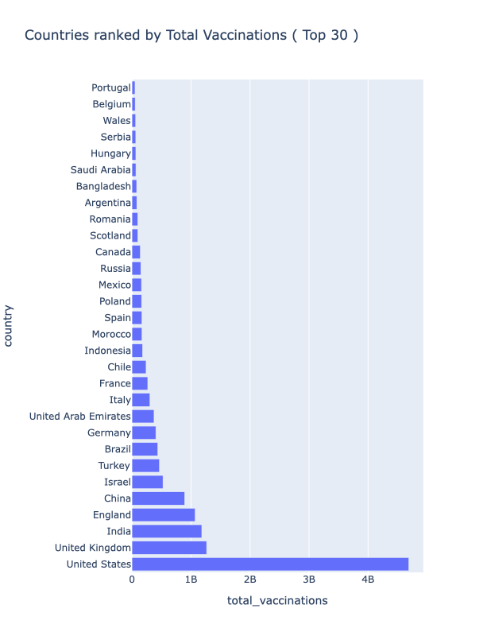
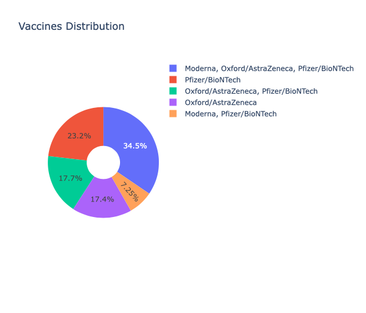
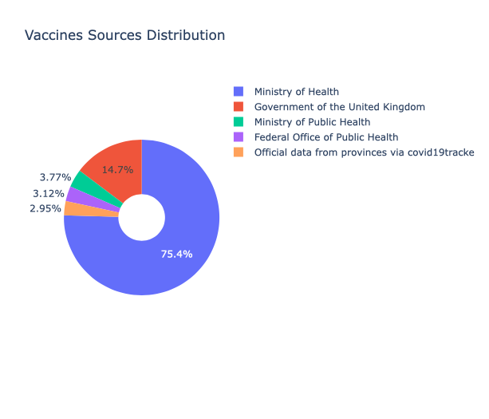

# COVID-19 Vaccination Process 

## Motivation 
When it comes to 2021, the most influential event is probably the distribution of COVID-19 vaccination dispatch process. In this section, I will visualize the vaccination dispatch process. 

## Dataset Overview 
The dataset used in this project could be found at [kaggle](https://www.kaggle.com/gpreda/covid-world-vaccination-progress). It breifly describes the process of vaccination dispatch process around the world in various countries. 

## Load Libraries and Dataset 

```python
    import pandas as pd 
    import numpy as np 
    import plotly as plly 
    import plotly.express as px 
    import plotly.graph_objects as go 

    vaccinate_data = pd.read_csv('./data_source/country_vaccinations.csv')
    vaccinate_data.info()
```

```text 
    <class 'pandas.core.frame.DataFrame'>
    RangeIndex: 8451 entries, 0 to 8450
    Data columns (total 15 columns):
    country                                8451 non-null object
    iso_code                               8451 non-null object
    date                                   8451 non-null object
    total_vaccinations                     5231 non-null float64
    people_vaccinated                      4688 non-null float64
    people_fully_vaccinated                3186 non-null float64
    daily_vaccinations_raw                 4415 non-null float64
    daily_vaccinations                     8260 non-null float64
    total_vaccinations_per_hundred         5231 non-null float64
    people_vaccinated_per_hundred          4688 non-null float64
    people_fully_vaccinated_per_hundred    3186 non-null float64
    daily_vaccinations_per_million         8260 non-null float64
    vaccines                               8451 non-null object
    source_name                            8451 non-null object
    source_website                         8451 non-null object
    dtypes: float64(9), object(6)
    memory usage: 990.4+ KB 
```

## Countries Ranked by Total Vaccination 

```python 
    def get_total_vaccinations_by_country(vaccination_data):
    vaccinate_country = vaccination_data[['country', 'total_vaccinations']]
    vaccinate_country_grouped = vaccinate_country.groupby(by='country', as_index = False).sum()
    vaccinate_country_sorted = vaccinate_country_grouped.sort_values(by='total_vaccinations', ascending=False)
    return vaccinate_country_sorted

    total_vaccination_countries = get_total_vaccinations_by_country(vaccinate_data).head(30)

    fig = px.bar(
        total_vaccination_countries, 
        x="total_vaccinations", 
        y="country", 
        orientation="h",
        title="Countries ranked by Total Vaccinations ( Top 30 )"
    )
    fig.update_layout(
        height=800, 
    )
    fig.show()
```

 

Observing from the bar chart above, the top countries that contains most vaccinations is The United States. Followed by United Kingdom, India and England. 

## Countries ranked by People Fully Vaccinated 

```python
    def get_total_vaccinations_by_country(vaccination_data):
        vaccinate_country = vaccination_data[['country', 'people_fully_vaccinated']]
        vaccinate_country_grouped = vaccinate_country.groupby(by='country', as_index = False).sum()
        vaccinate_country_sorted = vaccinate_country_grouped.sort_values(by='people_fully_vaccinated', ascending=False)
    return vaccinate_country_sorted

    total_vaccination_countries = get_total_vaccinations_by_country(vaccinate_data).head(30)

    fig = px.bar(
        total_vaccination_countries, 
        x="people_fully_vaccinated", 
        y="country", 
        orientation="h",
        title="Countries ranked by People Fully Vaccinated ( Top 30 )"
    )
    fig.update_layout(
        height=800, 
    )
    fig.show()
```

 

The number of people fully vaccinated is highest in the United States, followed by Israel, India and Germany. 

## People Vaccinated Ranked by Countries 

```python
    def get_total_vaccinations_by_country(vaccination_data):
        vaccinate_country = vaccination_data[['country', 'people_vaccinated']]
        vaccinate_country_grouped = vaccinate_country.groupby(by='country', as_index = False).sum()
        vaccinate_country_sorted = vaccinate_country_grouped.sort_values(by='people_vaccinated', ascending=False)
        return vaccinate_country_sorted

    total_vaccination_countries = get_total_vaccinations_by_country(vaccinate_data).head(30)

    fig = px.bar(
        total_vaccination_countries, 
        x="people_vaccinated", 
        y="country", 
        orientation="h",
        title="Countries ranked by People Vaccinated ( Top 30 )"
    )
    fig.update_layout(
        height=800, 
    )
    fig.show()
```

The top countries that ranked top are the United States, United Kingdom, England and India. 

## Vaccinate Distribution 

```python
    def get_gender_data(dataset):
        vaccines_data = dataset['vaccines']
        vaccines_df = pd.value_counts(vaccines_data).to_frame().reset_index()
        return vaccines_df 

    vaccines_df = get_gender_data(vaccinate_data)
    vaccines_df.head()
    
    
    def generate_fig(gender_data):
        vaccines = [
            'Moderna, Oxford/AstraZeneca, Pfizer/BioNTech',
            'Pfizer/BioNTech',
            'Oxford/AstraZeneca, Pfizer/BioNTech',
            'Oxford/AstraZeneca',
            'Moderna, Pfizer/BioNTech'
        ]
        values = [2047, 1374, 1051, 1031, 430]
        fig = go.Figure(data=[go.Pie(labels=vaccines, values=values, hole=.3)])
        fig.update_layout(
            title_text='Vaccines Distribution'
        )
        fig.show()
    
    generate_fig(vaccines_df)
```



## Vaccinate Sources Distribution 

```python
    def get_gender_data(dataset):
        vaccines_source_data = dataset['source_name']
        vaccines_df = pd.value_counts(vaccines_source_data).to_frame().reset_index()
        return vaccines_df 

    vaccines_source_df = get_gender_data(vaccinate_data)
    vaccines_source_df.head()
    
    
    def generate_fig(gender_data):
        vaccines = [
            'Ministry of Health',
            'Government of the United Kingdom',
            'Ministry of Public Health',
            'Federal Office of Public Health',
            'Official data from provinces via covid19tracke'
        ]
        values = [2664, 520, 133, 110, 104]
        fig = go.Figure(data=[go.Pie(labels=vaccines, values=values, hole=.3)])
        fig.update_layout(
            title_text='Vaccines Sources Distribution'
        )
        fig.show()
    
    generate_fig(vaccines_df)
```



